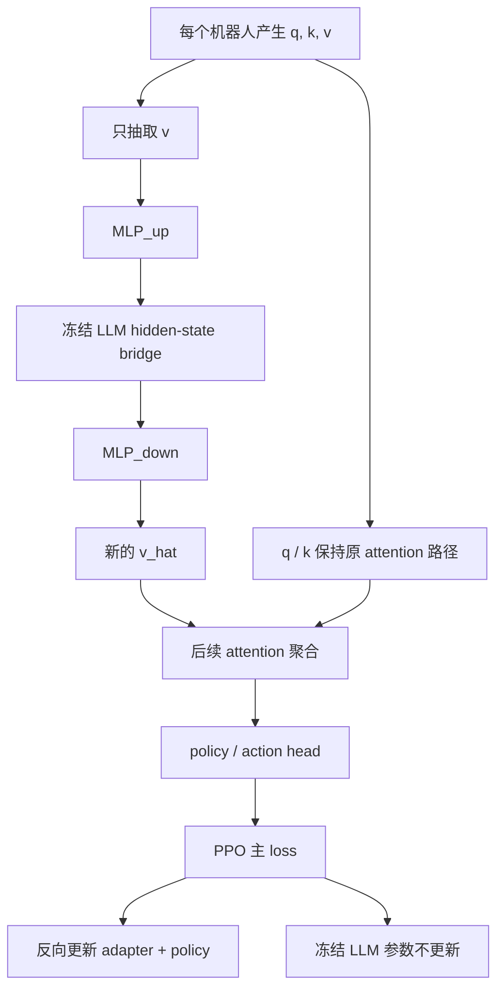

# LLM V-Adapter 项目文档

## 0. 设计结论

核心结构：**每个机器人先产生 q、k、v，只把 v 单独抽出来，送入 MLP + 冻结 LLM + MLP，得到新的 v，再把这个新 v 放回后续 attention 聚合流程**。

两条关键边界：

- q / k 不进入 adapter，仍然保留在原来的 attention 路径里。
- **不要把 v 更新前后的差异 loss 放进主 loss。** 主训练只需要依赖后面新的 v 参与策略计算，让 PPO 的梯度把 adapter 一起更新起来。

v_before / v_after 的差异量仅作为诊断日志（`rec_loss` 在 `aux` dict 中），不参与优化。

---

## 1. 项目目标

在 CenturyMaze 多机器人 PPO 训练中，引入一个**只处理 v 通道**的 LLM 适配器，让每个机器人的通信值向量先经过一次高维语义变换，再返回给后续 attention 聚合和策略网络使用。

> 每个机器人先产出 qkv，但只把 v 拿去做 MLP + LLM + MLP；得到新的 v 以后，再把它送回后续 attention 聚合。

---

## 2. 正确的数据流



### 2.1 张量语义

- q：查询向量，决定"谁去读谁"。
- k：键向量，决定"谁会被读"。
- v：值向量，承载真正被聚合的内容。

LLM V-Adapter 只处理 v，不碰 q / k。

### 2.2 关键输出

- `v_old`：原始值向量。
- `v_hat`：经过 MLP + LLM + MLP 后的新值向量。
- `v_final`：真正送回后续 attention 聚合的值向量。

默认定义是：

```text
v_final = v_hat
```

不做 alpha 残差混合。如果需要 warm-up 稳定性，可以通过调整学习率或 adapter 输出尺度来实现，不通过前向 blend。

### 2.3 不要改动的原始 policy 闭环

下面这条链路是原始 policy 的核心闭环，应该保持不变：

```text
attention 聚合后的 msg -> mlpin -> rnn -> mlpout -> 动作 / belief / 下一轮 qkv
```

adapter 只负责在 qkv 进入 attention 聚合之前改写 v；聚合之后的 msg 继续按原 policy 流程进入 mlpin、rnn、mlpout，生成动作、belief 和下一轮 qkv。

---

## 3. 模块划分

### 3.1 qkv 生成模块

- 从每个机器人的局部观测和通信状态中生成 q、k、v。
- 保留原本 attention 路由逻辑。

### 3.2 LLM V-Adapter

- 只接收 v。
- 用 MLP_up 把 64 维 v 映射成高维伪 token。
- 用 EmbeddingAligner 将伪 embedding 对齐到 LLM token embedding 分布。
- 送入冻结 LLM 做 hidden-state 变换。
- 用 MLP_down 再映射回 64 维。

标准结构：

```text
v_old -> MLP_up -> EmbeddingAligner -> frozen LLM -> hidden state -> MLP_down -> v_hat
```

**无 LLM 模式**（`--llm_bridge_enabled 0`）：LLM 和 EmbeddingAligner 完全绕过，等价于一个 autoencoder：

```text
v_old -> MLP_up -> IdentityBridge -> MLP_down -> v_hat
```

### 3.3 后续 attention 聚合模块

- 使用原来的 q / k。
- 使用新的 v_final（即 v_hat）作为 attention 的 value 输入。
- 输出供 policy / memory / next-step inference 使用的通信结果 msg。

### 3.4 PPO 主网络

- 读取聚合后的通信结果。
- 生成动作分布、价值估计和训练所需的辅助量。
- 用 PPO 主 loss 做在线更新，梯度沿 `v_final → MLP_down → 冻结 LLM → MLP_up` 回传。

---

## 4. LLM V-Adapter 详细设计

### 4.1 MLP_up

把每个机器人的原始 64 维 v 变成大模型可处理的高维伪 token。

结构：

```text
64 -> 512 -> 512 -> n_tokens * H
```

其中 `H` 为 LLM 的 hidden_size（Qwen2-VL-2B 为 1536，LLaMA-3.1-8B 为 4096）。当 `n_tokens = 8` 时，每个机器人得到 `8 × H` 维输出。

注意：初版不使用 LayerNorm(64)，原因是希望尽量保留原始 64 维 v 的数值尺度信息。

### 4.2 EmbeddingAligner（embedding 分布对齐）

**这是新增模块**，替代了原来粗暴的 `output_scale=0.05`。

在 `LLMVAdapter.__init__` 时，从冻结 LLM 的 token embedding 矩阵（`[vocab_size, H]`）中计算 per-dim 的均值和标准差，存为 buffer。

forward 时对每个 pseudo-token 向量独立做：
1. 标准化到零均值单位方差
2. 重新缩放到 LLM embedding 空间的均值和方差

```text
z_norm = (z - z.mean(dim=-1)) / z.std(dim=-1)
z_aligned = z_norm * embed_std + embed_mean
```

这确保了送入 LLM 的伪 embedding 在数值范围上与真实 token embedding 一致，避免 garbage-in-garbage-out。

当 bridge 为 stub 模式时，aligner 为 `nn.Identity()`（不做变换）。

### 4.3 冻结 LLM bridge（FrozenLLMBridge）

LLM 只做 hidden-state 变换，不做 next-token prediction，不做参数更新。

约束：

- 冻结参数（`requires_grad = False`）。
- 关闭 `use_cache`。
- 使用 `inputs_embeds` 直接输入伪 embedding。
- **不传 `attention_mask`**，使用 LLM 默认 causal attention。项目文档初版认为双向交互可后续处理。
- 更新阶段不要把整个 LLM 前向包进 `torch.no_grad()`，否则梯度回不到 MLP_up。
- 不硬编码 hidden_size 检查，兼容不同维度的 LLM。

支持的 LLM：

| 模型 | hidden_size | 参数 |
|------|-------------|------|
| Qwen2-VL-2B-Instruct | 1536 | 当前默认 |
| LLaMA-3.1-8B | 4096 | 配置 `LLM_DIM=4096` 即可 |

模型自动发现逻辑在 `MODEL_CANDIDATES` 列表中按顺序查找，通过 `_has_weights()` 检测权重文件（支持任意分片数）。

### 4.4 MLP_down

把 LLM 输出的高维 token 表示再压回 64 维。

结构：

```text
n_tokens * H -> 512 -> 512 -> 64
```

### 4.5 IdentityBridge（stub 模式）

当 `--llm_bridge_enabled 0` 时使用。前向直接返回输入，不做任何变换。允许在无 LLM 的情况下单独训练 UpMLP + DownMLP autoencoder。

### 4.6 模型权重检测

`_has_weights()` 使用 `glob` 匹配 `model-00001-of-*.safetensors`，兼容 2 分片（Qwen2-VL-2B）和 4 分片（LLaMA-8B）等任意分片数。

---

## 5. 在线训练设计

### 5.1 主目标

主目标仍然是 PPO loss，包含：
- policy loss：主驱动，通过 v_final 反向更新 adapter
- value loss：价值拟合
- entropy：探索约束

**adapter 不需要额外的 rec_loss 作为主目标**。

### 5.2 正确的优化方式

```text
PPO 主 loss
  -> 后续 attention / policy / value
  -> attention 聚合（使用 v_hat 作为 value）
  -> MLP_down
  -> 冻结 LLM bridge
  -> EmbeddingAligner
  -> MLP_up
```

### 5.3 rec_loss 处理

`rec_loss = MSE(v_hat, v_old.detach())` 在 `llm_v_adapter.py` 中计算，存放在 `aux` dict 中，仅作为诊断日志。**不参与训练 loss，不加入 PPO 主目标。**

### 5.4 CUDA graph 兼容

冻结 LLM 的 forward 与 CUDA graph capture 不兼容（transformers 内部的 `torch.all()` 等操作）。因此：

- **adapter 启用时**（`USE_POLICY_LLM_ADAPTER=1`）：`accelerate=False`，走普通 forward/backward 路径
- **adapter 关闭时**：`accelerate=True`，保持 CUDA graph 加速

对应代码：`session.py` 中 `accelerate=not cfg.USE_POLICY_LLM_ADAPTER`。

LLM bridge 内部增加了 `_is_cuda_graph_capturing()` 检测，当 CUDA graph 录制时跳过 `torch.utils.checkpoint`，直接调用 bridge。

---

## 6. 形状约定

假设：

- `E` = env 数
- `R` = 每个 env 的机器人数量
- `Dv` = 64
- `T` = `n_tokens`
- `H` = LLM hidden_size（1536 或 4096）

则：

```text
原始 v:      [E*R, 64]               (2D 输入自动 unsqueeze)
MLP_up 输出: [E*R, T, H]
Aligner 后:  [E*R, T, H]
LLM 输入:    [E*R, T, H]             (reshape 为 [E*R, T, H])
LLM 输出:    [E*R, T, H]
MLP_down:    [E*R, 64]
v_final:     [E*R, 64]
```

---

## 7. 代码落点与关键实现

### 7.1 `src/mazebots0/llm_v_adapter.py`

| 组件 | 职责 |
|------|------|
| `UpMLP` | 64 → 512 → 512 → n_tokens*H |
| `EmbeddingAligner` | 对齐伪 embedding 到 LLM 分布 |
| `FrozenLLMBridge` | 冻结 LLM，`get_embed_weight()` 暴露 embedding 矩阵 |
| `IdentityBridge` | stub 模式，直通 |
| `DownMLP` | n_tokens*H → 512 → 512 → 64 |
| `LLMVAdapter` | 封装完整 `v_old → v_hat` 流程 |
| `_has_weights()` | glob 匹配任意分片数 |
| `_is_cuda_graph_capturing()` | CUDA graph 安全检测 |

### 7.2 `src/mazebots0/model.py` — Policy.forward()

核心改动：adapter 在 `com()` **之前**处理 v，不再处理 msg：

```python
# 原来（错误）：msg = com(qkv) → adapter(msg) → blend → mlpin
# 现在（正确）：
if self.use_llm_v_adapter:
    q, k, v = qkv.split(cfg.QKV_SPLIT, dim=-1)
    v_hat, self.llm_aux = self.llm_v_adapter(v)
    qkv = torch.cat((q, k, v_hat), dim=-1)
else:
    self.llm_aux = None

msg = self.com(qkv, speaking_mask, n_envs)    # attention 聚合用新 v
x = self.mlpin(torch.cat((x, msg), dim=-1))   # 后续闭环不变
mem = self.rnn(x, mem)
a, bg, qkv = self.mlpout(mem).split(...)
return a, bg, qkv, mem, msg.detach()
```

关键点：
- `v_final = v_hat`，直接替换，不做 alpha 残差混合
- `self.com()` 和之后的 mlpin/rnn/mlpout 闭环完全不变
- `self.llm_rec_loss` 已删除，不参与训练

### 7.3 `src/mazebots0/session.py`

| 组件 | 职责 |
|------|------|
| `Session.ARGS` | 新增 `--llm_bridge_enabled`、`--llm_adapter_n_tokens` 等 |
| `Session._attach_loss_recorder()` | 替换 TensorBoard writer 为 CSV+PNG；hook `update()` 实现 per-5-batch 中间日志 |
| `LiveLossRecorder` | CSV 日志 + PNG 绘图 |

#### 日志与可视化

**CSV 记录**：`step, Env/reward, Main/loss, Main/policy, Main/value, Main/entropy, Aux/loss, Aux/loc_nll_off`

**PNG 绘图**（`loss_curve.png`）：

```
┌──────────────────────┐
│ REWARD   Env/reward  │  ← 最核心指标
├──────────────────────┤
│ LOSS     Main/loss   │  ← 训练动态
│          Main/policy │
└──────────────────────┘
```

- `Main/value`、`Main/entropy`、`Aux/loss`、`Aux/loc_nll_off` 保留在 CSV 中但不出现在图中
- `_smart_ylim()`：用 2%–98% 分位数裁剪异常值，仅 10% 边距，曲线紧贴数据
- 刷新频率：每个 epoch 更新一次 PNG

#### Per-5-batch 中间日志

通过 `register_forward_hook` 捕获模型输出的 recurrent state，在 `update()` 内部按每 5 个 batch 拆分并记录中间统计：

```
一个 update(seq) 的 20 个 batch：
├── chunk [0:5]   → forward hook 捕获 mem → 日志点
├── chunk [5:10]  → 注入上一 chunk 的 mem → 日志点
├── chunk [10:15] → 日志点
└── chunk [15:20] → 日志点
```

每个 epoch 约 12 个中间日志点 + 1 个 epoch 汇总点。

**注意**：`Env/reward` 在 rollout 阶段累积，update 期间 delta 始终为 0，中间日志自动跳过。

### 7.4 `src/mazebots0/config.py`

LLM V-Adapter 相关配置：

```python
USE_POLICY_LLM_ADAPTER = 1      # 是否启用 adapter
LLM_DIM = 1536                   # Qwen2-VL-2B hidden_size（LLaMA 用 4096）
LLM_MODEL_PATH = None            # None = 自动从 MODEL_CANDIDATES 发现
LLM_ADAPTER_N_TOKENS = 8         # 每个 bot 的伪 token 数量
LLM_ADAPTER_OUTPUT_SCALE = 0.05  # 已废弃（被 EmbeddingAligner 替代）
LLM_ADAPTER_LR = 1e-4            # adapter 独立学习率
LLM_HIDDEN_DIM = 512             # UpMLP/DownMLP 隐藏层维度
LLM_HIDDEN_LAYER = -1            # 取 LLM 最后一层 hidden state
LLM_BRIDGE_MODE = 'auto'         # 'auto' | 'stub'（由 --llm_bridge_enabled 控制）
```

### 7.5 `src/mazebots0/task.py`

- 计算环境奖励，提供 PPO 训练所需的 reward 张量
- 无 adapter 相关改动

### 7.6 `src/mazebots0/train.py`

- `BeliefAuxTask`：辅助通信训练
- 已移除 `llm_rec_loss` 加入主 loss 的逻辑
- 已移除 `Aux/policy_adapter_alpha`、`Aux/policy_adapter_lambda_rec` 等废弃 stats

### 7.7 `src/mazebots0/train_llm_v_adapter.sh`

训练提交脚本示例：

```bash
$PYTHON_BIN session.py \
  --ctrl_mode 2 --headless 1 \
  --model_name llm_v_qwen1_env1_robot8 \
  --n_envs 1 --n_bots 8 --batch_size 8 \
  --com_mode 1 --aux_mode 1 --rwd_mode 3 \
  --llm_bridge_enabled 0    # 0 = stub 模式, 1 = LLM 模式
```

---

## 8. 推荐超参

```text
n_tokens = 8
H = 1536           # Qwen2-VL-2B（LLaMA-3.1-8B 则用 4096）
hidden_dim = 512
llm_adapter_lr = 1e-4
```

训练调优：

- 太慢：降低 `n_tokens`、`batch_size`、`n_bots`
- 太不稳：检查 `v_final` 是否直接回到 attention；检查 LLM 前向没有被 `torch.no_grad()` 包裹
- adapter 学不到：优先确认梯度链路完整，检查 `Main/entropy` 是否从最大值（ln(动作数)）开始下降

---

## 9. CLI 参数

| 参数 | 默认值 | 说明 |
|------|--------|------|
| `--use_policy_llm_adapter` | 1 | 启用 policy LLM adapter |
| `--llm_bridge_enabled` | 1 | 0 = stub 直通，1 = LLM 参与 |
| `--llm_adapter_n_tokens` | 8 | per-bot 伪 token 数 |
| `--llm_adapter_output_scale` | 0.05 | 已废弃（aligner 替代） |
| `--llm_model_path` | None | None = 自动发现 |
| `--n_bots` | 16 | 每个 env 的机器人数（必须整除 batch_size） |
| `--batch_size` | 8 | mini-batch 大小（必须为 n_bots 的整数倍） |

---

## 10. 常见误区

### 10.1 q / k 不应该一起送进 LLM

q / k 是路由结构，v 才是内容载荷。当前设计只处理 v。

### 10.2 v 前后对齐 loss 不能进主 loss

这个 loss 只会逼 adapter 复制旧 v，不代表任务目标。rec_loss 仅作为 aux 诊断值存在，不参与训练。

### 10.3 adapter 放进 no_grad 会导致 MLP_up 收不到梯度

LLM 可以冻结参数（`requires_grad=False`），但 `torch.no_grad()` 会阻断梯度回传。正确做法是冻结参数但允许梯度穿过计算图。

### 10.4 rec loss 不是最终目标

真正的优化目标是 PPO reward。rec_loss 仅用于观察 adapter 是否保留了原始 v 的信息。

### 10.5 batch_size 必须是 n_bots 的整数倍

`divmod(batch_size, n_bots)` 的余数必须为 0，否则 BeliefAuxTask 初始化会报错。

---

## 11. 一句话总结

**你的真实设计不是"把整个 qkv 交给大模型"，而是"每个机器人先产出 qkv，只抽出 v 送入 MLP + 冻结 LLM + MLP，再把新的 v 放回后续 attention 聚合"；同时，不要把 v 前后对齐 loss 放进主 loss，主训练只需要依赖后面的新 v，让 PPO 通过它反向更新 adapter。**
